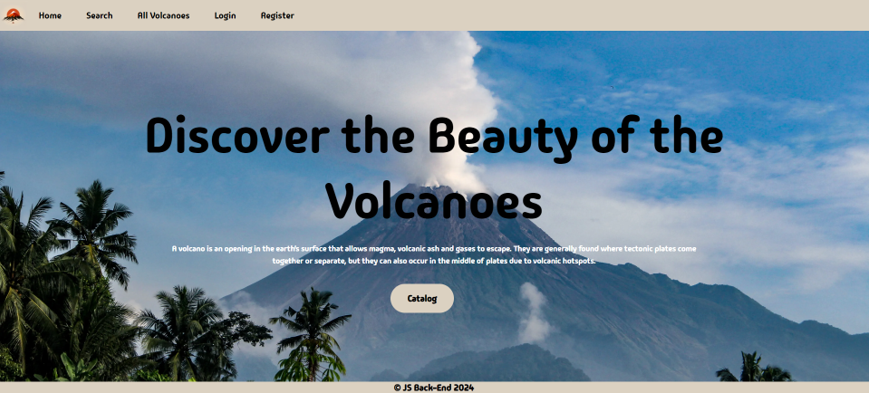
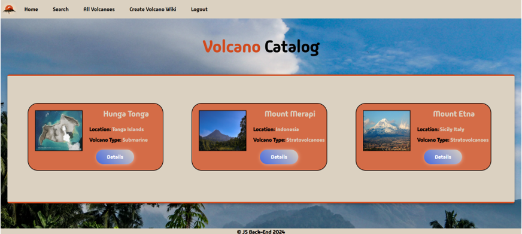
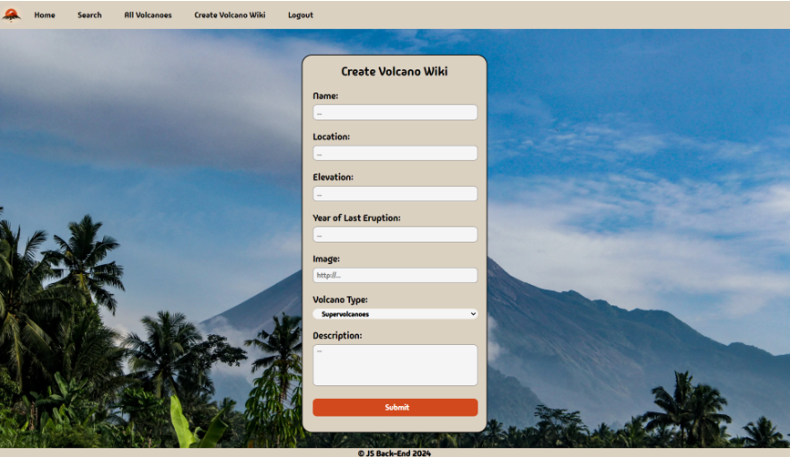

# Magma-Heaven

## SoftUni JS Back-End Course - Exam Preparation Task

The **Magma-Heaven** 🌋 project is an essential part of my preparation for the **SoftUni JavaScript Back-End Course**. The goal is to integrate front-end structures with back-end logic using JavaScript, creating a functional web application focused on the beauty of volcanoes. The app will allow users to explore volcanoes, register accounts, and interact with volcano posts by creating, voting, editing, or deleting them.

---

## Table of Contents

- [Installation](#installation)
- [Features](#features)
- [Technologies](#technologies)
- [Usage](#usage)
- [SoftUni JS Back-End Course Key Technologies and Features](#softuni-js-back-end-course-key-technologies-and-features)

---

## Installation

To set up the project locally, follow these steps:

1. **Clone the repository:**
    ```bash
    git clone https://github.com/MBashov/Magma-Heaven.git
    ```

2. **Navigate into the project directory:**
    ```bash
    cd Magma-Heaven
    ```

3. **Install dependencies:**
    ```bash
    npm install
    ```

4. **Run the application:**
    ```bash
    npm start
    ```

Once the app is running, visit `http://localhost:3000` in your browser to see it in action!

---

## Features

The **Magma-Heaven** app includes the following key features:

- **User Authentication**: Register, log in, and access personalized content.
- **Authorization**: Certain actions (such as editing and deleting posts) are restricted to the post's author.
- **Volcano Management**: Users can add, edit, and delete volcano posts. They can also vote for volcanoes they're interested in, (only if they aren’t the post’s author).
- **Profile Page**: View and manage the volcanoes you've created or voted for.

---

## Technologies

This project leverages the following technologies:

- **Node.js**: JavaScript runtime for server-side operations.
- **MongoDB**: NoSQL database to store volcano and user data.
- **Express.js**: Web framework to build the server.
- **Handlebars**: Templating engine for dynamic HTML rendering.
- **CSS & HTML**: UI styling and structure, provided by SoftUni.

---

## Usage

After setting up the application, here's how you can use it:

1. **Sign Up / Log In**: Create an account or log into an existing one.
2. **Volcano Management**: Add new volcanoes, edit details, or delete them from your list.
4. **Search Functionality**: Filter volcanoes by **name** and **type** using a case-insensitive search.
5. **Voting**: Vote for volcanoes you're interested in (as long as you're not the author).

---

## SoftUni JS Back-End Course Key Technologies and Features  

Here’s an overview of key technologies and features covered in this course:

### **Node.js Streams and Utilities**  
Efficiently handle I/O operations with Node.js streams to improve memory management and performance in data processing. Common utilities are included to simplify frequent tasks, boosting productivity.

### **Express.js and Templating**  
Build the web application using Express.js, a flexible Node.js framework. It enables quick routing, middleware integration, and a clean project structure. A templating engine (such as **Handlebars**) is used for rendering dynamic content on the client-side.

### **NoSQL and MongoDB**  
MongoDB, a NoSQL database, is used to store data. Its flexible schema allows for rapid development and scaling as the project grows.

### **Mongoose**  
Mongoose simplifies interaction with MongoDB by providing a schema-based solution for modeling data. It enables features such as validation, querying, and population of related data.

### **Sessions and Authentication**  
Sessions are implemented to track user activity across multiple requests. Authentication, including login and sign-up functionality, ensures that user data is secure.

### **Validation and Error Handling**  
Input validation ensures that user-entered data is in the correct format. Errors are handled gracefully, with user-friendly messages and robust logging for debugging.

---

## Screenshots

Here are some screenshots of the Magma-Heaven application:

- **Home Page:**

    

- **Volcano List:**

    

- **Create Volcano Page:**

    
